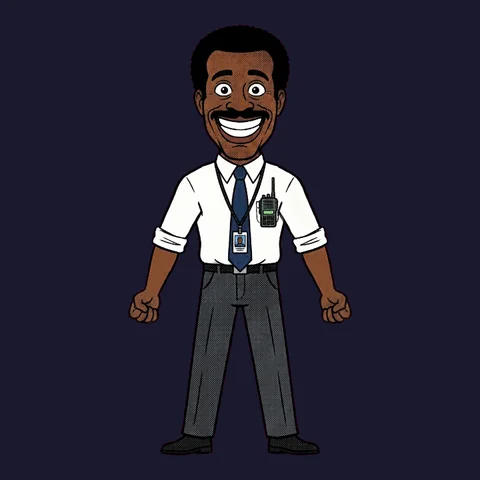
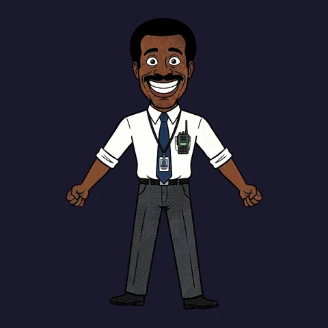
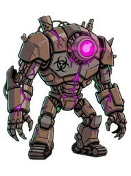
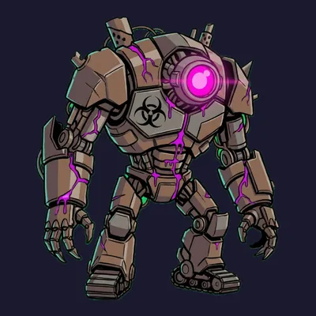

# TextRig

**Animate a single flat PNG with your AI agent.** No PSD layers required, no
pre-cut parts, no Spine license. You hand your agent an image and a sentence ("make
the character breathe", "a sleepy idle"). Using TextRig's MCP tools, the agent
cuts the image into pieces, places bones, writes keyframes, renders the result,
checks its own work against a checklist and iterates.

The output is a standard **DragonBones** rig (`_ske.json` + `_tex.json` +
`_tex.png`). DragonBones runtimes exist for Pixi, Phaser, Cocos, Egret, Unity
and others.

**One flat drawing, no layers.** The source is a single 896×1200 PNG. The
markup draws 10 polygons over it; `build_rig` cuts the pieces, fills the art
hidden behind moving joints and binds everything to 12 bones (clips below play
at 2× the authored speed, as in our game):

| Source PNG | `idle` | `idle_2` |
|---|---|---|
|  |  |  |

**Already have layers? TextRig uses them as pieces.** This character came as
a hand-separated layered export. Its 21 layer PNGs became 17 pieces plus 4
swap variants (closed eyelids, cigarette positions), with no cutting and no
fill (`"fill": "none"`, `--underlap 0`):

| Layers | `idle` |
|---|---|
|  |  |

A smaller multi-piece example with rigid limbs and a deform hose:

| Source PNG | `idle` |
|---|---|
|  |  |

Every animation above was built by the tools in this repo from the markup in
[`examples/`](examples/) ([`manager/`](examples/manager/),
[`character-layers/`](examples/character-layers/),
[`robot/`](examples/robot/)). The GIFs were rendered by the same `render` tool
the agent uses to check its own work.

## What it does

TextRig is a local [MCP](https://modelcontextprotocol.io) server. The agent
(Claude Code, Cursor, or any MCP client with image input) does the creative
work. The code handles the math and the rendering:

1. **Look.** The agent reads the PNG and decides what should move.
2. **Author.** It writes three small JSON documents: a skeleton (bones in image
   pixels), optionally a pieces manifest (polygon cuts, draw order, swap
   variants, deform meshes) and animations (keyframe tracks).
3. **Build.** `build_rig` validates the markup and cuts the pieces. It fills
   the areas that were hidden behind moving parts, generates meshes and
   weights, packs the atlas and writes the DragonBones rig. Validation errors
   come back verbatim and name the fix.
4. **Inspect.** `render` returns a filmstrip image, with optional zoomed
   close-ups. The agent judges it against a 7-point checklist: static zones,
   joint separation, revealed holes, draw order, swap timing, loop seam and
   amplitude.
5. **Iterate.** The agent makes one change per round, for up to 4 rounds,
   then delivers the result or reports what is still wrong.

Supported rig features:

- **Whole-image deform rigs:** one mesh with bones and heat-diffusion
  weights, for sway, breathing and bobbing.
- **Multi-piece rigs:** `rigid` pieces on bones, `swap` pieces for blinks and
  glows, `deform` pieces for hoses and capes, animated draw order and
  automatic occlusion fill.
- **Path constraints and wave tracks** for hair, tails and ribbons.
- **Morph pieces:** optical-flow FFD between prepared keyframe images.
- **Background removal** for inputs without alpha, either border keying or
  the rembg neural cutout.
- **A human-in-the-loop markup editor** (`open_markup_review`) where you can
  drag joints and cut boundaries in a browser before the build.

## Quick start

```sh
git clone https://github.com/blackoutbuild/textrig.git
cd textrig
./install.sh
```

`install.sh` is idempotent. It creates `pipeline/.venv`, installs the Python
dependencies, downloads the background-removal weights (u2net, ~176 MB, to
`~/.u2net/`), runs `pnpm install` in `renderer/` and installs Playwright's
headless Chromium.

### Claude Code

```sh
claude mcp add textrig -- /absolute/path/to/textrig/mcp/serve.sh
```

### Any other MCP client (Cursor, Claude Desktop, ...)

TextRig is a stdio server with no arguments and no environment variables:

```json
{
  "mcpServers": {
    "textrig": {
      "command": "/absolute/path/to/textrig/mcp/serve.sh"
    }
  }
}
```

Then ask your agent something like:

> Rig ~/art/robot.png and give it a heavy idle loop. Use the textrig tools.

The agent should call `rigging_guide` first. Every tool description points it
there.

## Tools

| Tool | What it does |
|---|---|
| `rigging_guide(topic="core")` | The rigging guide, split into topics: `core` (conventions, choosing a rig type, skeleton archetypes, animation vocabulary, the checklist, JSON formats), `pieces` (polygon-cutting rules, binding types, draw-order tracks, path constraints, error → knob map), `example` (the complete robot rig) and `all`. |
| `build_rig(name, image_path, skeleton, animations, pieces?, ...knobs)` | Validates the markup and builds the DragonBones rig. The markup is passed as JSON values, not file paths. Piece builds also return a debug image of the cuts and bones. Optional knobs: `bg`, `bg_tolerance`, `fill_blur`, `fill_mode`, `underlap`, `cols`, `power`, `weights_algo`. |
| `render(name, animation="idle", frames=8, size=256, gif=false, zoom?, fx?, fy?)` | Renders a built rig to a filmstrip that comes back as an image. With `gif=true` it also writes a GIF. `zoom`/`fx`/`fy` render a close-up. Limits: frames ≤ 12, size ≤ 512. |
| `preview(name)` | Starts the local preview server (if it isn't running) and returns a URL where a human can watch the rig live at 60 fps, with animation, speed and background switches. |
| `open_markup_review(name, image_path, skeleton, pieces?)` | Opens a browser editor for the human: drag joints and polygon vertices, split pieces with a cut stroke, leave a note for the agent. |
| `await_markup_review(name, timeout_s=50)` | Collects the human's edits from the review page. It returns "still editing" until the human presses Done. |

More detail (workspace layout, limits, timeouts) is in [`mcp/README.md`](mcp/README.md).

## Output formats

- **`out/<name>_ske.json` + `out/<name>_tex.json` + `out/<name>_tex.png`:**
  the DragonBones 5.x JSON rig and texture atlas. This is the product.
  It is tested against `pixi-dragonbones-runtime` 8.0.3 on Pixi 8, and the
  exact emitted shape is documented in
  [`docs/dragonbones-format-contract.md`](docs/dragonbones-format-contract.md).
- **`out/mcp-<name>.filmstrip.png`:** the inspection filmstrip.
- **`out/mcp-<name>.gif`:** a full-loop GIF, 30 fps (when `gif=true`).
- **`out/<name>.debug.png`:** piece cuts and bones drawn over the source
  (piece builds only).

`out/` is disposable and gitignored. The inputs for each build are saved to
`out/mcp/<name>/`.

## Using it without MCP

The same pipeline runs from the shell:

```sh
pipeline/build_rig.sh robot examples/robot/source.png \
  examples/robot/skeleton.json examples/robot/animations.json \
  --pieces examples/robot/pieces.json
(cd renderer && pnpm render out:robot idle robot --match-runtime --frames 8 --size 256 --gif --out-repo)
(cd renderer && pnpm preview robot)   # live preview at http://localhost:3020
```

## Requirements

- macOS or Linux. Development and testing were done on macOS; Linux should
  work but is less tested.
- **Python 3.10+.** Tested on 3.14.
- **Node.js 18+ and pnpm.** Tested on Node 22 and pnpm 9.
- **Disk:** about 1.2–1.6 GB in total. That is ~640 MB for the Python venv
  (onnxruntime and OpenCV), ~210 MB for `node_modules`, ~176 MB for the u2net
  weights in `~/.u2net/` and ~350–550 MB for Playwright's Chromium in its
  shared cache. The repo itself is under 20 MB.
- An MCP client whose model can **see images**, because the self-check loop
  depends on reading filmstrips.

## Tests

```sh
pipeline/.venv/bin/pytest pipeline/tests -q     # Python pipeline + MCP server
cd renderer && pnpm test                        # markup editor geometry
```

## Limitations

- **The agent is the rigger.** The quality of the result depends on the
  model's visual judgement: where it places joints, how it cuts polygons and
  how it reads a filmstrip. Strong vision models do well. Weak ones produce
  sloppy cuts. The markup review editor lets a human fix placement by hand.
- **No generative inpainting.** Areas revealed behind a moving piece are filled
  by extending or diffusing the neighbouring pixels. That works for joint
  seams but cannot draw a limb that the image never showed. For large
  reveals, cut the polygons differently or supply a separate layer PNG.
- **2D bone and mesh animation only.** There is no 3D turnaround and no pose
  that the source drawing can't support. Large rotations of rigid pieces look
  like cut-out animation, because that is what they are.
- **DragonBones is the only export target.** There is no Spine export. The
  legacy `*.rig.json` format in `format/README.md` is a reference/debug format
  and has no player in this repo.
- Morph pieces allow only one animation per manifest.
- `preview` and `open_markup_review` run a local Vite dev server on port
  3020 and are meant for a human with a browser on the same machine.

## License

[MIT](LICENSE) © 2026 Blackout Interactive

---

Built by Blackout Interactive — https://blackout.build
